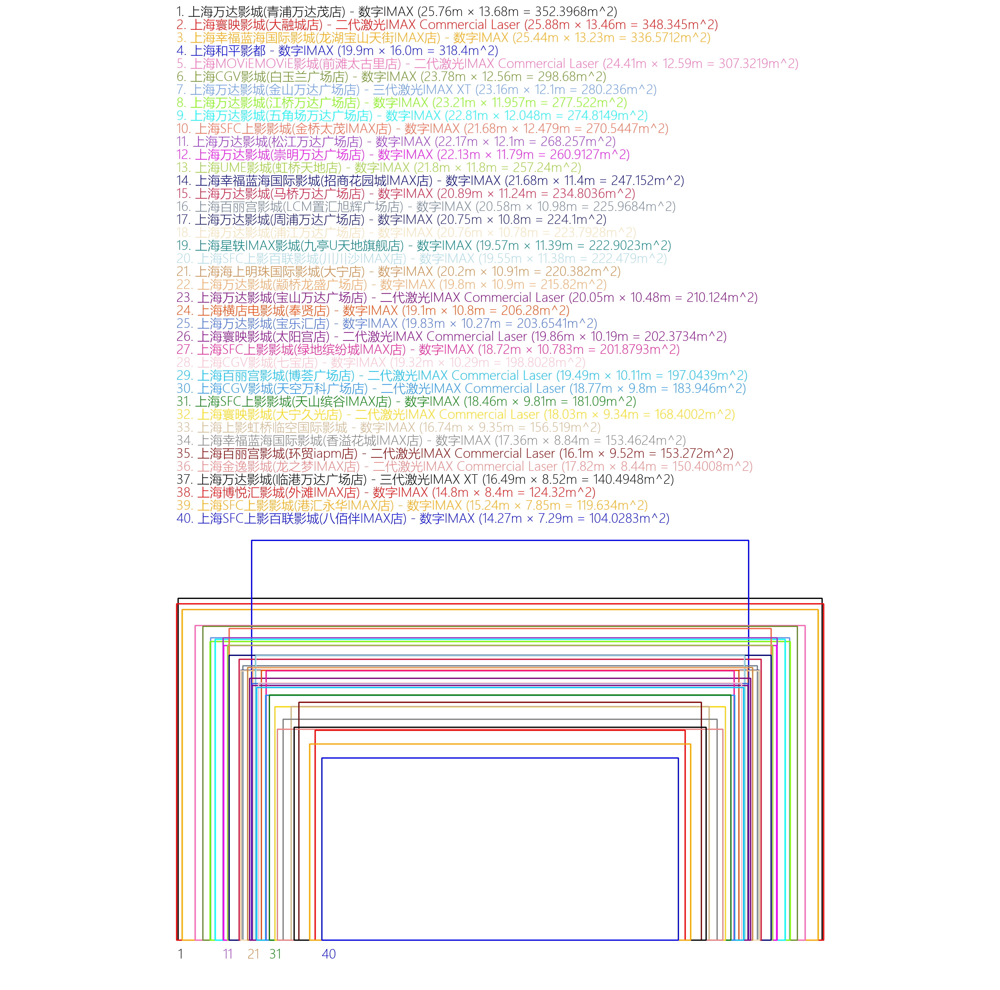
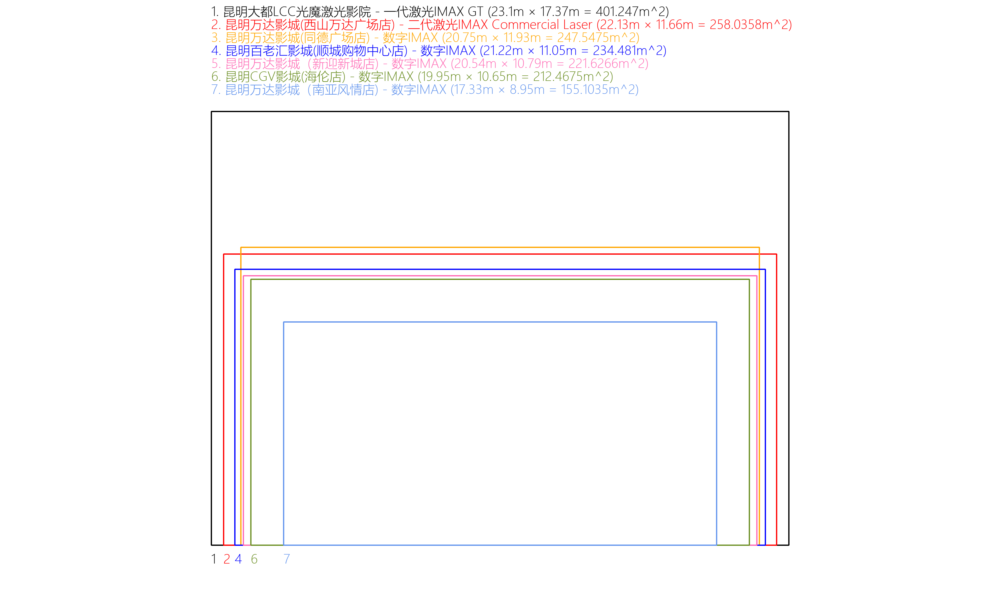

# 银幕尺寸绘制

数据采自[全球IMAX及其他系统影厅分布](https://docs.qq.com/sheet/DQ3FEUUZJdklNSWJP?tab=BB08J2)

### 数据准备
登录QQ PC端，快捷键Ctrl+Alt+O，识别文本，保存于name.txt，银幕尺寸信息保存于size.txt，这里只采集了IMAX影厅。

### 环境配置

安装Anaconda3

```
conda create -n drawsize python=3.8

conda activate drawsize

pip install numpy

pip install matplotlib

pip install opencv-python

pip install Pillow
```

### 绘制步骤

将"C:\Windows\Fonts\微软雅黑"复制到本文件夹`screen-size/`下。

运行`convert.py`，将size.txt转成size1.txt。(这里我已经准备好了size1.txt，如需自己绘制其他影厅或城市，则需要自行准备)

`说明：name.txt与size1.txt即为我们想要的，每一行对应一个影厅与银幕尺寸，不同的城市由短连接号隔开。`

运行`draw.py`，得到银幕尺寸图，水平分辨率默认为4000。

结果保存于`size/`文件夹下。([这里](https://github.com/Zzh-tju/screen-size/tree/main/size)提供了一些成品绘制图，影厅信息采集于2023.6.24，具有超过4块IMAX银幕的城市，排除了无银幕尺寸信息的影厅。)



